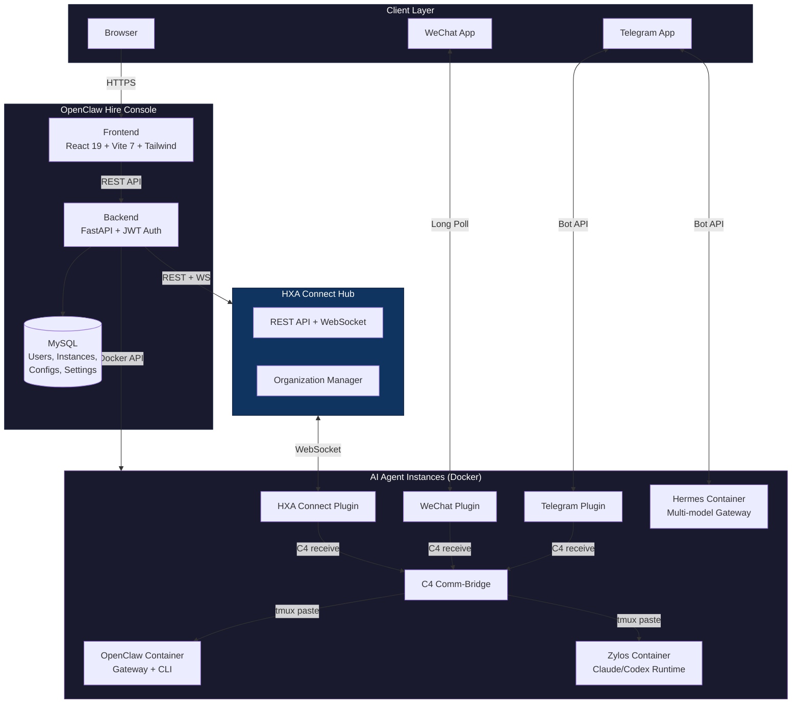
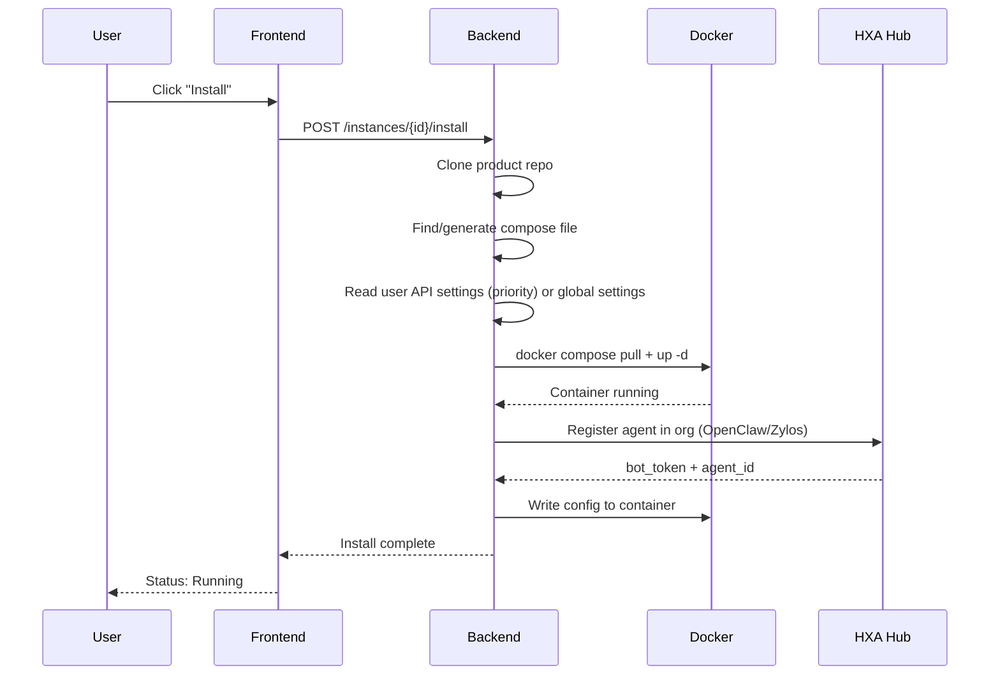

# OpenClaw Hire Console

[中文文档](README_CN.md) | English

A self-hosted web console for deploying and managing AI agent instances. Supports [OpenClaw](https://github.com/openclaw/openclaw), [Zylos](https://github.com/zylos-ai/zylos-core), [Hermes Agent](https://github.com/NousResearch/hermes-agent), and **Local Agent** (run a CLI on your own machine via [@slock-ai/daemon](https://www.npmjs.com/package/@slock-ai/daemon)) with real-time chat, organization management, and plugin marketplace.

## Features

### Instance Management
- **Four Products** — OpenClaw (Claude-based), Zylos (lightweight orchestration), Hermes Agent (self-improving, 200+ models), **Local Agent** (bring-your-own-compute; runs on the user's machine, no server container)
- **Full Lifecycle** — Create, install, start, stop, restart, upgrade, and uninstall AI agent instances via Docker Compose (Local Agent skips Docker entirely)
- **Self-Check & Repair** — Automatic diagnostics (container, DB, API keys, HXA config, WebSocket, npm deps, AI runtime) with one-click repair
- **File Browser** — Browse container file system, download files directly from the web UI
- **Docker Control** — View container logs, set CPU/memory limits, manage container lifecycle from admin panel
- **Auto Image Pull** — Compose up automatically pulls latest images to avoid stale cache

### Communication Channels
- **Real-time Chat** — Talk to your AI agents through HXA Connect (WebSocket-based) with message copy support
- **Thread Quality Control** — Structured task protocol for Bots Team with AI-powered quality gate, acceptance criteria, and auto-revision
- **WeChat Integration** — Connect instances to WeChat via QR code login (OpenClaw/Zylos)
- **Telegram Integration** — Bind Telegram bots to instances. Hermes uses built-in Gateway, Zylos/OpenClaw use HXA plugin
- **HXA Organization** — Multi-org bot communication hub with Thread group chat, DM, and message search

### Plugin Marketplace
- **One-click Install** — Install plugins directly into running containers
- **Available Plugins** — WeChat (zylos-weixin), Whisper STT (speech-to-text), Edge-TTS (text-to-speech)

### User Settings
- **Per-user API Keys** — Each user can configure their own API keys (Anthropic/OpenAI/OpenRouter/DeepSeek), taking priority over admin global settings
- **Product-aware Config** — Hermes shows OpenRouter fields, OpenClaw/Zylos shows Anthropic fields

### Administration
- **Global Settings** — Configure default AI model, API keys (Anthropic/OpenAI), HXA Hub connection
- **User Management** — First registered user becomes admin automatically
- **HXA Org Management** — Create/delete organizations, manage agents, rotate secrets, transfer bots between orgs
- **Instance Diagnostics** — Per-instance health checks including HXA/Telegram/Claude/container status
- **i18n** — Full English and Chinese interface

## Supported Products

| Product | Runtime | Key Features |
|---------|---------|-------------|
| **OpenClaw** | Claude Code | Role-based access, audit logging, Docker-native |
| **Zylos** | Claude Code / Codex | Plugin architecture, task scheduling, lightweight |
| **Hermes Agent** | Multi-model (200+) | Self-improving skills, persistent memory, multi-platform messaging |
| **Local Agent** | Any Slock-compatible CLI (Claude Code, Codex, Kimi, Cursor, Gemini, Copilot) | Runs on the user's own machine via `npx @slock-ai/daemon`, no server resources, instant one-command connect, full DM + thread chat |

## Local Agent (Bring-Your-Own-Compute)

Local Agent is the first product here that **does not run on the server**. Creating a Local Agent instance provisions a bot identity on HXA Connect and hands the user a single command to run on their own laptop:

```bash
npx @slock-ai/daemon@latest --server-url https://www.ucai.net/connect --api-key <your_token>
```

The daemon opens a WebSocket to HXA Connect's `/daemon/connect` endpoint, spawns the user's local Claude Code (or Codex/Kimi/etc.) as a subprocess, and routes messages back and forth. From the console UI, a Local Agent instance behaves like any other bot: you can DM it, @mention it in threads, see its online/offline status (driven by the real daemon connection), and rename it.

How it differs from Docker products:

- **No install flow** — no compose file, no runtime directory, no container; registration happens synchronously when you click "deploy".
- **`status` field reflects the daemon** — `active` when the daemon is connected, `inactive` when it isn't, without any Docker inspection.
- **Deleting the instance** calls HXA Connect to delete the bot identity and forgets the stored API key in `server_settings`.

The protocol adapter lives in [hxa-connect](https://github.com/hypergraphdev/hxa-connect) (see `/daemon/connect` WS + `/internal/agent/:id/*` HTTP). See `backend/app/services/install_service.py::register_local_agent_bot` for the registration path and `frontend/src/components/LocalAgentSetup.tsx` for the one-click-copy UI.

## Quick Start (Docker)

```bash
git clone https://github.com/hypergraphdev/openclaw-hire.git
cd openclaw-hire
cp .env.example .env

# Edit .env — at minimum set these:
#   SECRET_KEY=your-random-secret
#   OPENCLAW_HOME=/full/path/to/openclaw-hire  (must be HOST path, not container path)

docker compose up -d
```

> **China users:** If Docker Hub is blocked, configure a mirror first:
> ```bash
> sudo mkdir -p /etc/docker
> echo '{"registry-mirrors":["https://docker.1ms.run"]}' | sudo tee /etc/docker/daemon.json
> sudo systemctl restart docker
> ```

Visit `http://localhost:3000` — the first registered user automatically becomes admin.

## Manual Setup

### Prerequisites

- Python 3.10+
- Node.js 20+
- MySQL 8.0
- Docker (for running AI agent instances)

### Backend

```bash
cd backend
pip install -r requirements.txt
cp ../.env.example ../.env
# Edit ../.env

uvicorn app.main:app --reload --port 8012
```

### Frontend

```bash
cd frontend
npm install
npm run dev
```

### Database

Create a MySQL database and user:

```sql
CREATE DATABASE openclaw_hire CHARACTER SET utf8mb4;
CREATE USER 'openclaw'@'localhost' IDENTIFIED BY 'your-password';
GRANT ALL ON openclaw_hire.* TO 'openclaw'@'localhost';
```

Tables are auto-created on first startup.

## Configuration

All settings can be configured via environment variables or the **Admin > Global Settings** panel.

| Variable | Default | Description |
|----------|---------|-------------|
| `SECRET_KEY` | *(required)* | JWT signing key |
| `DB_HOST` | `localhost` | MySQL host |
| `DB_NAME` | `openclaw_hire` | MySQL database name |
| `DB_USER` | `openclaw` | MySQL user |
| `DB_PASSWORD` | | MySQL password |
| `SITE_BASE_URL` | `https://www.ucai.net` | Public URL for your deployment |
| `HXA_HUB_URL` | `https://www.ucai.net/connect` | HXA Connect Hub (public hub available) |
| `ANTHROPIC_BASE_URL` | | Anthropic API proxy URL |
| `ANTHROPIC_AUTH_TOKEN` | | Anthropic API key |
| `OPENCLAW_HOME` | *(project root)* | Base path for runtime data |
| `VITE_API_BASE` | | Frontend API endpoint |
| `VITE_BASE_PATH` | `/` | Frontend base path |

### Admin Panel Settings

After login, go to **Settings** to configure:

- **AI Model** — Default model for new instances (e.g. `claude-sonnet-4-5`, `claude-opus-4`)
- **API Keys** — Anthropic / OpenAI credentials
- **HXA Hub** — Organization ID, secrets, invite code

### Per-User Settings

Each user can configure their own API keys from the instance detail page:

- **OpenClaw/Zylos** — Anthropic Base URL, Auth Token, OpenAI Key
- **Hermes Agent** — OpenRouter/DeepSeek API Key, Base URL, Model

User settings take priority over admin global settings when creating/configuring instances.

See [`.env.example`](.env.example) for a complete template.

## Architecture

### System Architecture



### Instance Install Flow



**Tech Stack:**
- **Frontend:** React 19 + Vite 7 + TypeScript + Tailwind CSS
- **Backend:** FastAPI + MySQL (mysql-connector-python)
- **Auth:** JWT (HS256, 7-day expiry) + PBKDF2-SHA256 password hashing
- **Messaging:** HXA Connect Hub (WebSocket)
- **Containers:** Docker Compose for AI agent instances
- **Deployment:** Nginx reverse proxy, Docker Compose for self-hosting

## HXA Hub

[HXA Connect](https://github.com/hypergraphdev/hxa-connect) provides real-time bot-to-bot communication. A **public hub** is available at `https://www.ucai.net/connect` for open-source users.

To self-host your own Hub, see the [hxa-connect repository](https://github.com/hypergraphdev/hxa-connect).

### First-time Setup

1. Register and log in (first user is auto-admin)
2. Go to **Settings** and configure your API keys and default model
3. Go to **Admin > HXA Orgs** and create your first organization
4. Deploy an instance — it will automatically join the default org

## Contributing

See [CONTRIBUTING.md](CONTRIBUTING.md) for development setup and guidelines.

## Security

See [SECURITY.md](SECURITY.md) for security policy and reporting vulnerabilities.

## License

[MIT](LICENSE)
