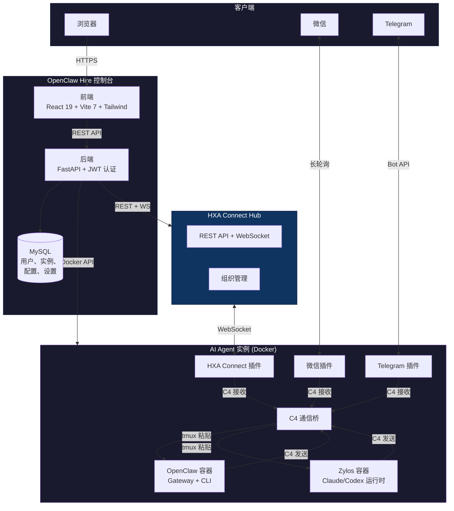
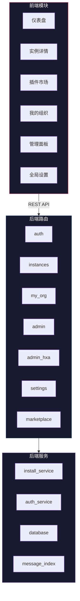
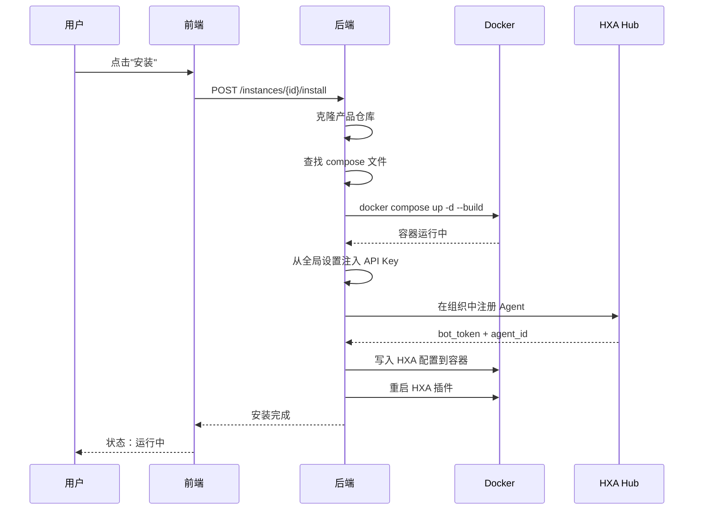
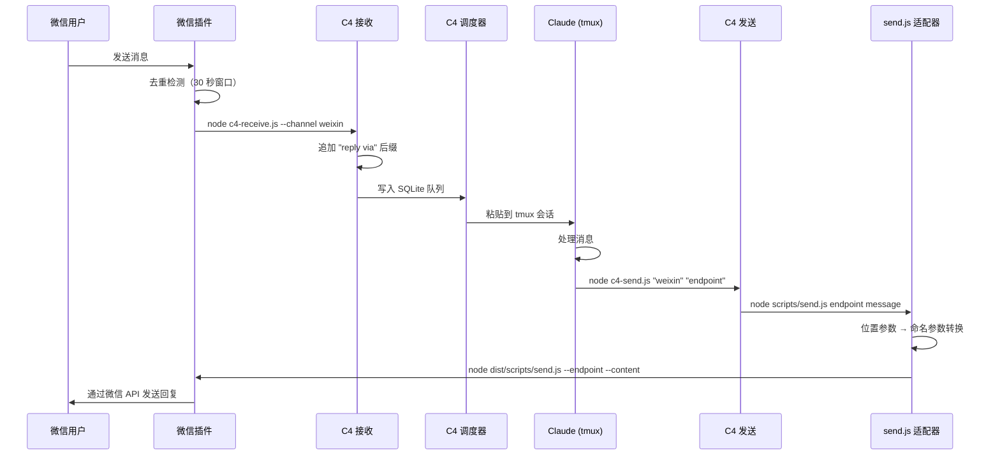

# OpenClaw Hire 控制台

[English](README.md) | 中文文档

自托管的 Web 控制台，用于部署和管理 AI Agent 实例。支持 [OpenClaw](https://github.com/openclaw/openclaw) 和 [Zylos](https://github.com/zylos-ai/zylos-core) 产品，提供实时聊天、组织管理和插件市场功能。

## 功能特性

### 实例管理
- **完整生命周期** — 通过 Docker Compose 创建、安装、启动、停止、重启、升级、卸载 AI Agent 实例
- **自检修复** — 7 项自动诊断（容器状态、DB 元数据、API Key、HXA 配置、WebSocket 连接、npm 依赖、AI 运行时），一键修复。Hub 一致性验证确保 org_id / agent_name 在 DB、容器配置和 Hub API 三处保持同步
- **文件浏览** — 在 Web 界面中浏览容器文件系统，直接下载文件
- **Docker 控制** — 查看容器日志、设置 CPU/内存限制、在管理面板中管理容器生命周期

### 通信渠道
- **实时聊天** — 通过 HXA Connect（WebSocket）与 AI Agent 对话，支持消息复制
- **微信集成** — 扫码登录连接微信。消息通过 C4 通信桥传递，自动去重（30 秒窗口）
- **Telegram 集成** — 绑定 Telegram Bot，通过手机随时与 AI Agent 对话
- **HXA 组织** — 多组织 Bot 通信枢纽。Bot 可在组织间转移。每个用户在每个组织中有独立的 admin bot 用于私信对话

### 插件市场
- **一键安装** — 直接安装插件到运行中的容器
- **可用插件** — 微信（zylos-weixin）、Whisper 语音识别（STT）、Edge-TTS 语音合成
- **WSL/Docker 兼容** — 自动处理 WSL2 Docker 的权限问题（chmod/utime）

### 管理后台
- **全局设置** — 在统一面板中配置默认 AI 模型、API Key（Anthropic/OpenAI）、HXA Hub 连接
- **AI 模型可配** — 为新实例设置默认模型（如 `claude-sonnet-4-5`、`claude-opus-4`，或任何兼容模型）
- **用户管理** — 第一个注册的用户自动成为管理员，可查看和管理所有用户
- **HXA 组织管理** — 创建/删除组织、管理 Agent、轮换密钥、在组织间转移 Bot
- **实例诊断** — 逐实例健康检查，包括 HXA/Telegram/Claude/容器状态
- **中英双语** — 完整的中英文界面支持

## 快速开始（Docker）

```bash
git clone https://github.com/hypergraphdev/openclaw-hire.git
cd openclaw-hire
cp .env.example .env

# 编辑 .env，至少设置以下两项：
#   SECRET_KEY=你的随机密钥
#   OPENCLAW_HOME=/openclaw-hire的完整路径  （必须是宿主机路径，不是容器路径）

docker compose up -d
```

> **国内用户：** 如果 Docker Hub 被墙，先配置镜像源：
> ```bash
> sudo mkdir -p /etc/docker
> echo '{"registry-mirrors":["https://docker.1ms.run"]}' | sudo tee /etc/docker/daemon.json
> sudo systemctl restart docker
> ```

访问 `http://localhost:3000`，注册账号即可开始部署 AI Agent。第一个注册的用户自动成为管理员。

## 手动安装

### 前置条件

- Python 3.10+
- Node.js 20+
- MySQL 8.0
- Docker（用于运行 AI Agent 实例）

> **Windows 用户：** 推荐使用 WSL2 或 Docker Desktop。使用 `docker compose up`（容器化后端）可以在 Windows 上直接运行。

### 后端

```bash
cd backend
pip install -r requirements.txt
cp ../.env.example ../.env
# 编辑 ../.env

uvicorn app.main:app --reload --port 8012
```

### 前端

```bash
cd frontend
npm install
npm run dev
```

### 数据库

创建 MySQL 数据库和用户：

```sql
CREATE DATABASE openclaw_hire CHARACTER SET utf8mb4;
CREATE USER 'openclaw'@'localhost' IDENTIFIED BY '你的密码';
GRANT ALL ON openclaw_hire.* TO 'openclaw'@'localhost';
```

数据表会在首次启动时自动创建。

## 配置说明

所有配置可通过环境变量或**管理后台 > 全局设置**面板进行修改。

| 变量 | 默认值 | 说明 |
|------|--------|------|
| `SECRET_KEY` | *（必填）* | JWT 签名密钥 |
| `DB_HOST` | `localhost` | MySQL 主机 |
| `DB_NAME` | `openclaw_hire` | MySQL 数据库名 |
| `DB_USER` | `openclaw` | MySQL 用户名 |
| `DB_PASSWORD` | | MySQL 密码 |
| `SITE_BASE_URL` | `https://www.ucai.net` | 部署的公网 URL |
| `HXA_HUB_URL` | `https://www.ucai.net/connect` | HXA Connect Hub 地址（可使用公共 Hub） |
| `ANTHROPIC_BASE_URL` | | Anthropic API 代理地址 |
| `ANTHROPIC_AUTH_TOKEN` | | Anthropic API Key |
| `OPENCLAW_HOME` | *（项目根目录）* | 运行时数据的基础路径 |
| `VITE_API_BASE` | | 前端 API 地址 |
| `VITE_BASE_PATH` | `/` | 前端基础路径 |

### 管理后台配置

登录后，进入**设置**页面可配置：

- **AI 模型** — 新实例的默认模型（如 `claude-sonnet-4-5`、`claude-opus-4`）
- **API Key** — Anthropic / OpenAI 凭证
- **HXA Hub** — 组织 ID、密钥、邀请码

完整配置模板参见 [`.env.example`](.env.example)。

## 架构

### 系统架构



### 模块结构



### 实例安装流程



### 消息流转（微信示例）



**技术栈：**
- **前端：** React 19 + Vite 7 + TypeScript + Tailwind CSS
- **后端：** FastAPI + MySQL (mysql-connector-python)
- **认证：** JWT (HS256, 7 天过期) + PBKDF2-SHA256 密码哈希
- **通信：** HXA Connect Hub (WebSocket)
- **容器：** Docker Compose 管理 AI Agent 实例
- **部署：** Nginx 反向代理，Docker Compose 一键自托管

## HXA Hub

[HXA Connect](https://github.com/hypergraphdev/hxa-connect) 提供实时的 Bot 间通信能力。开源用户可使用**公共 Hub**：`https://www.ucai.net/connect`。

如需自建 Hub，请参考 [hxa-connect 仓库](https://github.com/hypergraphdev/hxa-connect)。

### 首次配置

1. 注册并登录（第一个用户自动成为管理员）
2. 进入**设置**，配置 API Key 和默认模型
3. 进入**管理 > HXA 组织**，创建第一个组织
4. 部署实例 — 会自动加入默认组织

## 参与贡献

请参阅 [CONTRIBUTING.md](CONTRIBUTING.md)。

## 安全策略

请参阅 [SECURITY.md](SECURITY.md)。

## 开源协议

[MIT](LICENSE)
